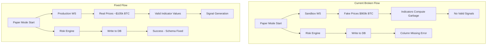

# Fix AtlasBot Trading Issues

## Root Cause Analysis

From the backend logs, I identified three interconnected problems:

### Issue 1: Database Schema Mismatch (CRITICAL)
The code expects columns and tables that don't exist in your Supabase database:

```
ERROR: Could not find the 'average_latency' column of 'risk_metrics'
ERROR: Could not find the 'equity' column of 'daily_equity'
ERROR: Could not find the table 'public.exchange_credentials'
```

The code in [`atlas/apps/core-node/src/trading/risk-engine.ts`](atlas/apps/core-node/src/trading/risk-engine.ts) tries to persist:
- `average_latency`
- `timestamp`

But the migration in [`supabase/migrations/20251212155124_43ec7808-f3d1-463b-a0f7-593deb197083.sql`](supabase/migrations/20251212155124_43ec7808-f3d1-463b-a0f7-593deb197083.sql) creates a different schema.

### Issue 2: Sandbox Connection (CRITICAL)
The bot connects to Coinbase sandbox (`wss://ws-feed-public.sandbox.exchange.coinbase.com`) which returns **fake test data**:

```
Added candle for BTC-USD: O=789901.08 H=900000 L=630872.04 C=630872.04
```

BTC is NOT $900k - this is simulated sandbox data. The logic in [`atlas/apps/core-node/src/api/server.ts`](atlas/apps/core-node/src/api/server.ts) line 338 sets:
```typescript
environment: mode === 'live' ? 'production' : 'sandbox'
```

Paper mode = sandbox (fake data). This is intentional for safety but you want real market data for testing.

### Issue 3: Signals Not Generating
Signal generation depends on:
1. Valid market data (currently fake)
2. Indicators computing correctly on that data
3. Strategy conditions being met

With sandbox's wild fake prices, indicator calculations behave erratically.

---

## Implementation Plan

### Step 1: Apply Database Migrations
Run the missing migrations in your Supabase SQL Editor. I'll create a consolidated migration script that adds the missing columns.

### Step 2: Switch to Production WebSocket for Paper Mode
Modify the trading engine config to use the production WebSocket feed (`wss://ws-feed.exchange.coinbase.com`) even in paper mode. This gives real market data while still simulating trades.

Key change in [`atlas/apps/core-node/src/api/server.ts`](atlas/apps/core-node/src/api/server.ts):
```typescript
exchange: {
  name: 'coinbase',
  environment: 'production'  // Always use real market data
}
```

### Step 3: Fix Risk Metrics Persistence
Update the risk engine to match the actual database schema, or update the schema to match what the code expects.

---

## Architecture



---

## Files to Modify

1. **Database Migration** - Create new SQL migration with missing columns
2. [`atlas/apps/core-node/src/api/server.ts`](atlas/apps/core-node/src/api/server.ts) - Change exchange environment logic
3. [`atlas/apps/core-node/src/trading/risk-engine.ts`](atlas/apps/core-node/src/trading/risk-engine.ts) - Align with actual schema (or fix schema)
